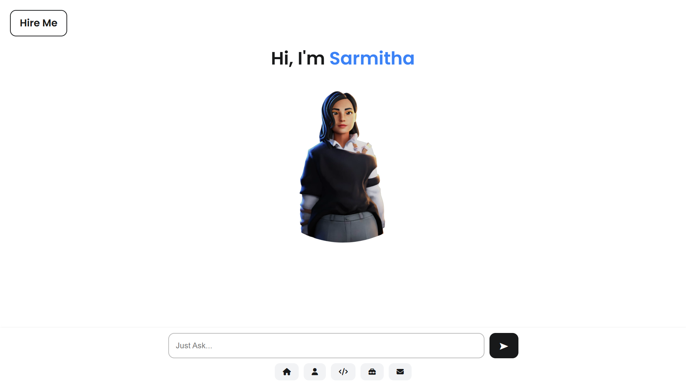

# AI Resume Portfolio

A **modular chatbot** that answers questions about my resume using keyword-based retrieval (BM25/bmrank) and a comprehensive system prompt for context and fallback.  
Deployed with **Python, Flask, and Gunicorn** on Render.

## 📸 Screenshot

---

## 🚀 Live Demo
**[👉 Try the chatbot here!](https://sarmitha-ai-portfolio.onrender.com/)**  
_⚠️ Note: The demo may take up to a minute to load on first visit due to free-tier hosting. Thanks for your patience!_

---

## 🛠️ Tech Stack

- **Python**
- **Flask**
- **Gunicorn**
- **rank_bm25** (BM25)
- **scikit-learn**
- **requests**
- **python-dotenv**
- **langdetect**
- **deep-translator**

---

## ✨ Features

- **Keyword Search**:  
  Uses BM25 (via `bmrank`) to fetch the most relevant resume chunks for each query.

- **System Prompt Grounding**:  
  Core resume details are included in the system prompt for comprehensive and reliable answers—even when retrieval misses.

- **Hybrid RAG Architecture**:  
  Balances efficient keyword-based retrieval with robust fallback system prompt grounding. Ready for upgrades to semantic or hybrid search.

- **Multilingual Support**:  
  Detects and translates user queries using `langdetect` and `deep-translator`, making the bot more accessible.

---

